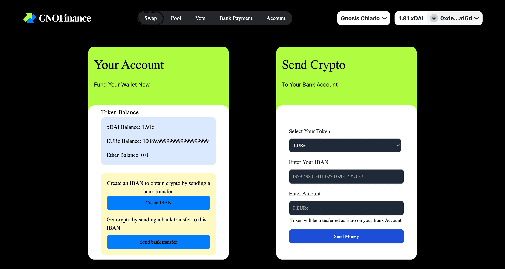
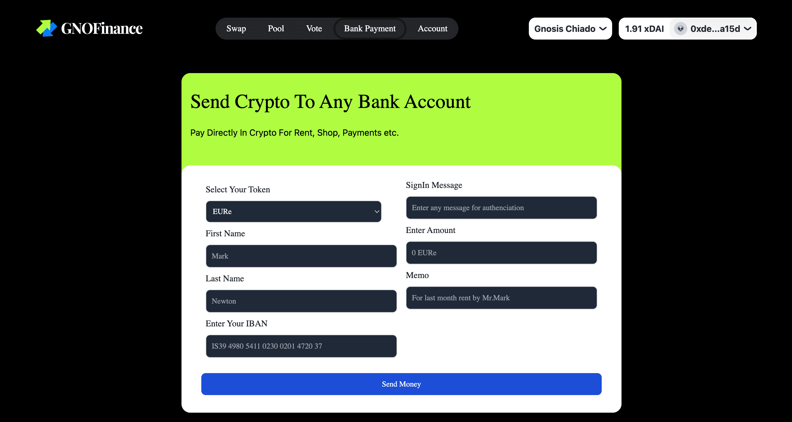

# GNOFinance Platform - Intersection of DeFi, CeFi and Traditional Banks

## 😃 Intro

---

 GNOFinance is a finance platform built for the **Gnosis Network**, a Layer 2 scalability solution built on top of Ethereum that aims to increase transaction throughput beyond traditional L2s while minimizing trust risk. 
 GNOFinance is built to reduce gap between the DeFi and CeFi world. It is a platform where users can swap, stake, bank payment, and earn interest on their crypto assets. **GNOFinance Platform is intersection of DeFi, CeFi and Traditional Bank world which is trying to provide users best of all worlds .** 

 ## 🏛️ Bank Payment

---

First of all, Lets discuss about the most innovative feature of GNOFinance where users can transfer any crypto from their crypto wallet (like Metamask wallet) to any bank account in form of EURO. We are leveaging Monerium and Request Finance for making it possible. 

### Send Crypto to your Bank Account

[]

User can send crypto to their own bank account just by entering their IBAN number.

### Send Crypto Payment to Any Bank Account

[]

User can send crypto to any bank account in form of EURO and reciever will get it like normal bank payment.
User can also enter the reason for payment like "Salary", "Rent", "Gift" etc. User need to enter Reciever bank details like IBAN, Reciever Name etc for sending payment. 

 
## 🪙 GNOF - GNOFinance Token

---

 GNOFinance has its own governance token called `GNOF`. This token will be used to vote on proposals for the platform, and also for liquidity providers to earn a share of the fees generated on the platform.

`GNOF token - 0x5a9486D42644Ddc3550289C6B7e60b8a55A45db5`

## 💱 DEX

---

One of the primary features of GNOFinance is its DEX where users can swap one token for another which is built by forking Uniswap V2 contracts, all while maintaining the highest security and transparency of a decentralized exchange.

`Factory - 0xcEB1A356106fE7074E4250964baC86ecca8E67F0`

`Router - 0x66579bd8E6B7c30F1F65E9eCf1404147284EC7B8`

`Pool Deployer - 0x80F2209C79B6BEf0ae3571f5De6c77a6cD360bd2`

`GNOFinance DEX - 0x085E9a646d5320C9333FD6F366DF6CcF5D84eAe4`

## ⚗️ Liquidity Pools

---

Another key feature of GNOFinance is its liquidity pool creation functionality. Users can provide liquidity to the platform, which helps to increase the overall liquidity of the platform and earn a share of the fees generated on trades made on their specific pool.

## ⚗️ Tokens Listing

---

`
tGNO token- 0x19C653Da7c37c66208fbfbE8908A5051B57b4C70

GNOF token - 0x5a9486D42644Ddc3550289C6B7e60b8a55A45db5

EURe token - 0xb106ed7587365a16b6691a3D4B2A734f4E8268a2

GDAI token = 0x227d00745cCB118Db8fAfaea118747f8a985A679

WGDAI token = 0x4E1cbE750BD21466F9C552F1237E401ebf3c43eC

GUSD token = 0xcFC0c8b2F01B655598587F0e48beb931616dCa26
`

## 🥞 Staking

---
We are going to implement this feature soon on GNOFinance Platform.

---

> Overall, GNOFinance is an all in one Finance platform that offers a range of features and benefits for crypto traders, enthusiasts and normal web2 people. GNOFinance Platform is intersection of DeFi, CeFi and Traditional Banks. 

## Thank you!

## ✅ GNOFinance Testnet Live Now!

`https://gnofinance.vercel.app/`